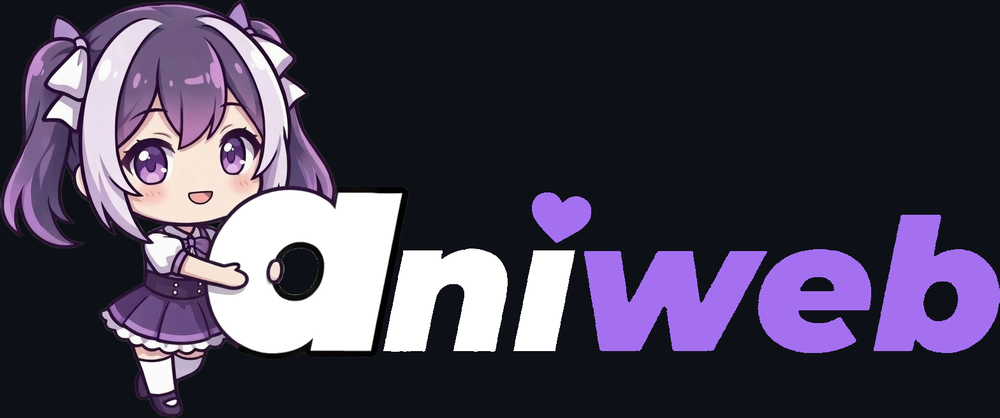

<div align="center">



_A local-first anime media client focused on performance, privacy, and personal library tracking._

[](https://opensource.org/licenses/MIT)

[](https://github.com/serifpersia/ani-web)


</div>

---

**ani-web** is a lightweight Node.js application for browsing anime metadata, managing a personal
watchlist, and tracking viewing progress through a clean frontend running on your own machine.

<div align="center">
  <sub>If ani-web is useful to you, consider giving the repo a ⭐. It helps others find the project.</sub>
</div>

## Features

Based on a lightweight architecture, ani-web includes:

- **Performance First:** Designed specifically to run smoothly on low-end hardware.
- **Built-in Search & Discovery:** Explore trending and popular anime metadata.
- **Watchlist Management:** Keep track of current, completed, and planned titles.
- **User Insights:** View personal library and progress statistics.
- **MAL Integration:** Seamlessly import your lists from MyAnimeList.

## Join ani-web Discord server

Be part of the ani-web Discord Server Community where you can connect with fellow users, ask questions, and share your experiences:

## [](https://discord.gg/2FTSPXCsvn)

## Getting Started

### Prerequisites

- **Node.js**: Version 22.5.0 or higher ([Download here](https://nodejs.org/)).

### ⚡ Quick Install

Open a terminal and run:

```bash
npm install -g ani-web
```

> **Note:** After the one-time setup, you can start the application anytime, from any directory, by simply opening a terminal and typing `ani-web`.

---

## Uninstalling

If you need to remove the application from your system, simply open a terminal and run:

```bash
npm uninstall -g ani-web
```

_This safely deletes the application files and removes the `ani-web` command from your system's PATH._

---

## Manual Installation (For Developers)

Want to poke around the source code or contribute? You can build the project manually.

**1. Clone the repository:**

```bash
git clone https://github.com/serifpersia/ani-web.git
cd ani-web
```

**2. Install, Build, and Run:**
Use provided run scripts that offer a menu to choose between a **Development** or **Production** setup. To run a development environment manually:

1. Run `npm install` to install core dependencies.
2. Run `npm run install:client` to install frontend tools (Vite, React, etc).
3. Run `npm run build` to build the source code.

**On Linux / macOS:**

```bash
chmod +x run.sh
./run.sh
```

**On Windows:**

```bat
run.bat
```

### Commands

Once installed globally, you can use the following commands:

- `ani-web` - Start the application.
- `ani-web --version` (or `-v`) - Check your installed version.

### Data Location

ani-web stores your persistent files in your OS app-data folder instead of inside the globally installed npm package:

- **Windows:** `%APPDATA%\ani-web`
- **macOS:** `~/Library/Application Support/ani-web`
- **Linux:** `$XDG_DATA_HOME/ani-web` or `~/.local/share/ani-web`

This folder contains your `.env`, database files, sync manifests, and Google token file. Existing installs will automatically migrate legacy files from the old `server/` folder on first launch when those files are still present.

---

## Cloud Sync (Optional)

**ani-web** can automatically sync your local data to the cloud. The app stays local-first: your
main database is a local SQLite file, and cloud sync exports/imports the app data as JSON when
needed.

Sync provider priority is:

1. **GitHub Cloud Sync**
2. **Google Drive Sync**
3. **Rclone Sync**

If GitHub is connected, it is used first. Google Drive and Rclone remain available as fallback or
legacy sync options.

### 1. GitHub Cloud Sync

GitHub Cloud Sync is the recommended setup. It uses GitHub's device login flow, so users do not
need to create a Google Cloud project, manage client secrets, or install external sync tools.

1. Open **ani-web**.
2. Go to **Settings** -> **Synchronization**.
3. Click **Sign in with GitHub**.
4. Open the shown GitHub device URL, enter the code, and approve access.

ani-web will create a private GitHub repository named `aniweb-sync-data` in your account and store
your sync data in JSON:

- Production mode uses `sync.json`.
- Development mode uses `sync.dev.json`.

The app requests GitHub repository access because it needs to create and update this private sync
repository. The GitHub token is stored locally in your ani-web app-data `.env` file.

### 2. Google Drive Sync

Google Drive sync is still supported. To use it, you need to provide your own Google Cloud
credentials:

1. Go to the [Google Cloud Console](https://console.cloud.google.com/).
2. Create a new project and enable the **Google Drive API**.
3. Configure the **OAuth Consent Screen** (set it to "External" and add yourself as a test user).
4. Create **OAuth 2.0 Client IDs** (Application type: "Web application").
5. Add `http://localhost:3000/api/auth/google/callback` to the **Authorized redirect URIs**.
6. Open **ani-web**, go to **Settings** -> **Synchronization**, and enter your **Client ID** and
   **Client Secret** in the Google authentication section.

### 3. Rclone Sync

If you prefer using **Mega**, **Dropbox**, or other providers, you can use [Rclone](https://rclone.org/):

1. Install Rclone on your system and ensure it's in your PATH.
2. Configure a remote using `rclone config`.
3. In **ani-web**, go to **Settings** -> **Synchronization** and select your remote name from the
   Rclone dropdown.

Rclone is used only when GitHub and Google Drive sync are not active.

---

## Disclaimer

ani-web is a local-first media client. It does not host, upload, store, or distribute copyrighted
video content.

Users are responsible for configuring and using the application in compliance with applicable laws
in their jurisdiction. All trademarks, titles, artwork, metadata, and copyrighted material belong to
their respective owners.

This project is provided for personal library management, metadata browsing, and local application
experimentation. The maintainers do not endorse or encourage copyright infringement.

## License

This project is open-source and licensed under the **MIT License** - see the [LICENSE](LICENSE) file for details.
